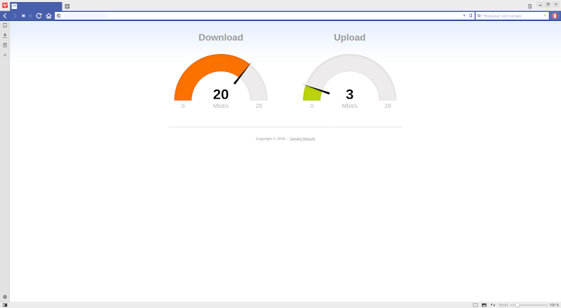

# Real-time bandwidth meter
The "php-meter" is a simple solution that uses PHP and Javascript technologies to offer a way to monitor the bandwidth consumption (download / upload) in real time of your internet link, thus allowing you to have an idea of how much traffic is being generated by your network.
## Development
### This project was developed and tested in the following environment:
```
- GNU/Linux 4.18.0-147.5.1.el8_1.x86_64 - CentOS Linux release 8.1.1911 (Core)
- PHP 7.2.11
- lighttpd/1.4.55
- jQuery 2.2.3
- JustGage 1.2.2
- Raphaël 2.1.4
```
## Setup
### 1 - Move this project to the web server's root directory
### 2 - Edit the file "include/config.inc.php" and make the necessary changes
### 3 - Set the owner and permissions according to the user who runs the web server daemon:
```
* Using the user "http" as an example:
chown -R http:http <WEB DIRECTORY>/php-meter/
find <WEB DIRECTORY>/php-meter/ -type d -exec chmod -R 755 {} +
find <WEB DIRECTORY>/php-meter/ -type f -exec chmod -R 644 {} +
```
### 4 - Finally, access the "php-meter": `http://<SERVER IP>/php-meter/`



*P.S. Sorry for the bad translation... Yes, I used Google Translate.*  :bow:
